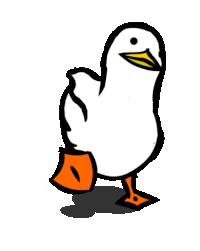

<!-- Header animado -->

<h1>
  Olá 👋, eu sou o Eduardo
</h1>

  Desenvolvedor focado em <strong>automação, back-end e soluções inteligentes</strong>

---

### 👨‍💻 Sobre mim

- 🔧 Desenvolvedor Jr apaixonado por **automações e back-end**
- 🧠 Sempre estudando **Python, Flask, FastAPI e APIs modernas**
- ⚡ Automação de processos com **Selenium, PyAutoGUI e Web Scraping**
- 🚀 Curto pegar ideias cruas e transformar em **produto funcional**
- 🌍 Portfólio: **[codejr.site](https://codejr.site)**

  

---

## 🧰 Tech Stack

### 🚀 Linguagens & Core

### 🤖 Automação & Back-end

### 🗄️ Banco de Dados

### 🛠️ Ferramentas

---

## 📌 O que eu curto construir

- 🤖 Bots e automações que economizam horas de trabalho
- 🔗 APIs REST performáticas
- 🧠 Ferramentas internas e SaaS
- 📊 Sistemas que conectam dados, planilhas e serviços

---

## 📈 GitHub Stats

---

### 💬 Vamos construir algo juntos?

